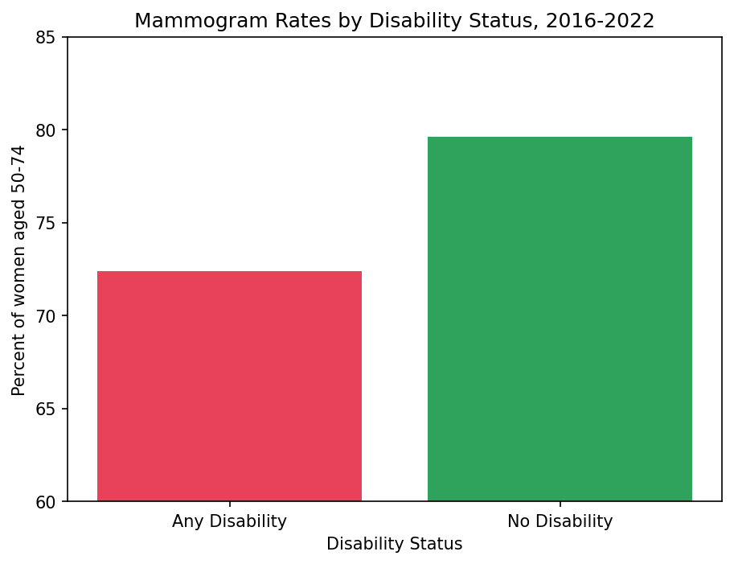
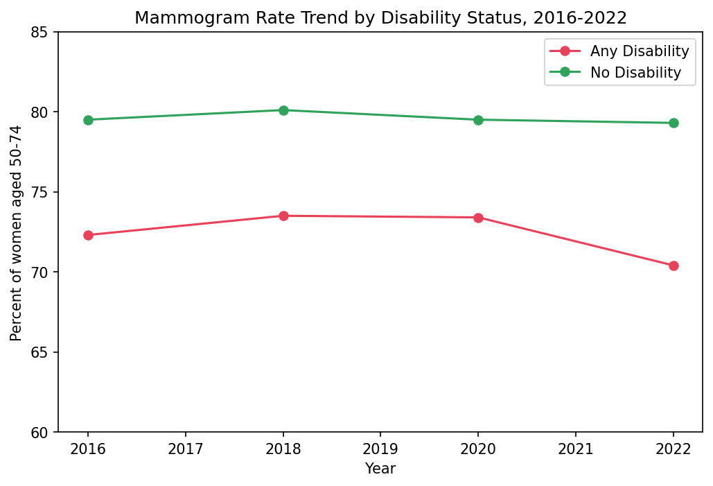
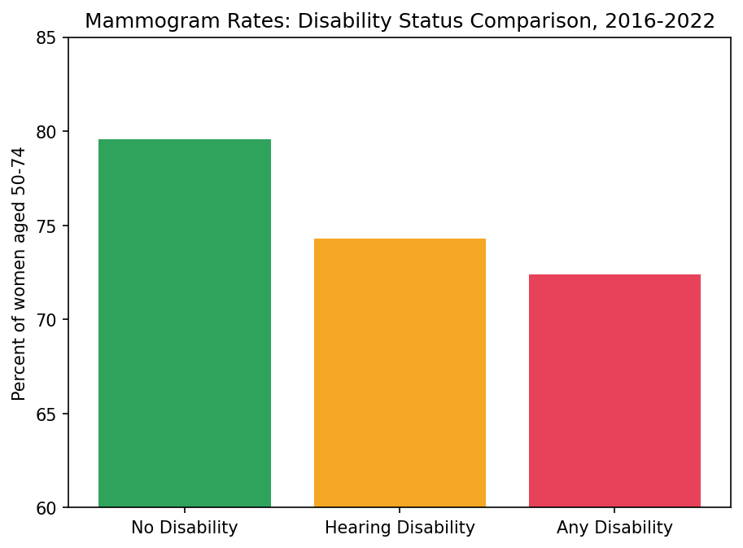

# Disability and Healthcare Access Analysis

**Do women aged 50-74 with disabilities get mammograms at the same rate as women without disabilities -- and is that gap wider for Deaf and hard-of-hearing women?**

---

## The Finding

Women with disabilities had a mammogram screening rate of **72.4%**, compared to **79.6%** among women without disabilities -- a gap of **7.2 percentage points**.

That gap **widened to 8.9 points in 2022**, the largest in the dataset, suggesting COVID-19 disproportionately disrupted screening access for women with disabilities even after the pandemic.

Among women with hearing disabilities specifically, the mammogram rate was **74.3%** -- slightly better than the overall disability group but still **5.3 points below** women without disabilities.

---

## Why It Matters

Mammograms save lives only when women actually get screened. A persistent gap in screening rates for women with disabilities means delayed diagnoses and worse outcomes.

The widening gap in 2022 points to a specific problem: while women without disabilities returned to pre-pandemic screening rates, women with disabilities did not. For Deaf and hard-of-hearing women, communication barriers at healthcare facilities -- inaccessible scheduling, lack of interpreters, providers who do not accommodate them -- may compound this gap further.

Health departments can use findings like these to target outreach specifically to women with disabilities, including accessible scheduling and communication accommodations.

---

## Data Source

**CDC Disability and Health Data System (DHDS)**
- Source: data.cdc.gov
- Built from: Behavioral Risk Factor Surveillance System (BRFSS) survey data
- Years: 2016-2022 (mammogram question asked in even years only)
- Geography: State level, 50 states plus DC and territories
- NAICS equivalent: N/A -- this is survey-based public health surveillance data

---

## Methods

- Filtered to the mammogram indicator (females 50-74) and Yes responses
- Compared Any Disability vs No Disability using `groupby` and `crosstab`
- Sub-analysis on Hearing Disability specifically
- Trend analysis across four survey years (2016, 2018, 2020, 2022)
- All analysis done in Python using pandas and matplotlib

---

## Key Charts

### Mammogram Rates by Disability Status

### Trend Over Time 2016-2022

### Portrait vs Hearing Disability vs No Disability

---

## Limitations

- Self-reported survey data -- respondents may misremember or over-report
- Does not control for age, income, or insurance status (potential confounders)
- Mammogram question only collected in even years -- four time points only
- BRFSS is a telephone survey; some Deaf individuals may be underrepresented, meaning the true gap for Deaf women may be larger than reported
- Indicator reflects 2016 USPSTF guidelines (ages 50-74); updated 2024 guidelines now recommend starting at age 40

---

## Tools

- Python 3 (pandas, numpy, matplotlib)
- Jupyter Notebook
- Data: CDC DHDS (data.cdc.gov)

---

## About

Analysis completed as part of the UMBC Training Centers Python Software Development and Data Analytics Certificate program.

Author: D.D., MPH
GitHub: github.com/FutureEpid
